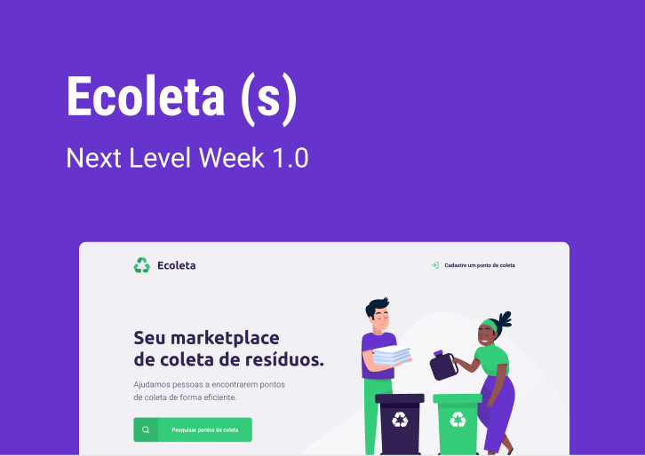

    

  <a href="#projeto" style="margin-right= 16">Projeto</a>
  <a href="#techs" style="margin-right= 16px;">Tecnologias</a>
  <a href="#apps">Aplicações</a>
  <a href="#execute">Execução</a>

# Projeto
## Ecoleta
#### Um marketplace que ajuda pessoas a encontrarem pontos de coletas de resíduos de forma eficiente

O projeto é um marketplace que oferece o serviço de cadastro de pontos de coletas de resíduos para que pessoas possam encontrar onde descardar seus resíduos de forma eficiente. Foi desenvolvido na [NextLevelWeek#01](https://github.com/Rocketseat/nlw-01-booster) oferecida pela [@Rocketseat](https://github.com/Rocketseat/).

# Techs
  Os projetos foram desenvolvidos utilizando as seguintes linguagens e tecnologias:
  - [NodeJS](https://nodejs.org/en/) v12.18.0
    - [NPM](https://www.npmjs.com/) v6.14.5
    - [Yarn](https://yarnpkg.com/) v1.22.4
  - [ReactJS](https://pt-br.reactjs.org/) v16.13.1
  - [Typescript](https://www.typescriptlang.org/) v3.7.2
  - [React-Native](https://reactnative.dev/) v0.61.4
    - [React-Native-Cli](https://www.npmjs.com/package/react-native-cli) v2.0.1
  - [Expo](https://expo.io/) v3.21.5

  Certifique-se de estar com todos os pacotes instalados na versão correspondente ou superior.

# Aplicações
  O projeto é composto por 03 (três) aplicações: [backend](backend/) desenvolvido em Node, [mobile](mobile/) desenvolvido em react-native por meio da ferramenta Expo e [web](/web) utilizando o ReactJS com o Typescript. 
      

# Execução
  Primeiramente, vamos clonar todo repositório para nossa máquina com o comando e acessar a pasta. 
  Em seu terminal, execute:
  > git clone https://github.com/marcosrodriigues/nlw-01.git && cd nlw-01/
  
  ### Backend
  Com o projeto clonado e acessando a pasta via terminal, acesse a pasta do 'backend' e execute 'npm install' para instalar todas as dependências do projeto:
  
  > cd backend/
  
  > npm install
  
  Aguarde finalizar e então inicie a aplicação com:
  
  > yarn dev
  
  Para deixar o servidor executando, abra um novo terminal e acesse a pasta "nlw-01/".
  
  ### Frontend
  Com a pasta aberta e o servidor rodando, basta repetir o processo feito no Backend:
  
  > npm install
  
  Aguarde finalizar e inicie a aplicação com:
  
  > yarn start
  
  Ao finalizar, uma aba será aberta no seu navegador com o endereço http://localhost:3000/.
  Para deixar o projeto frontend executando, abra um novo terminal e acesse a pasta "nlw-01/"
  
  ### Mobile
  #### Configuração mobile
  No mobile é simples, basta baixar o App Oficial do Expo na [Google Play](https://play.google.com/store/apps/details?id=host.exp.exponent&hl=pt_BR) ou [Apple Store](https://apps.apple.com/br/app/expo-client/id982107779).
  
  Depois, em seu terminal acesse a pasta do projeto mobile:
  
  > cd mobile/
  
  Instalar os pacotes de dependência:
  
  > npm install
  
  E executar o projeto:
  
  > yarn start
  
  Ao finalizar, será exibido um QRCode no seu terminal. Abra o aplicativo do Expo no seu dispositivo e clique em "Escanear QR Code". E agora você está acessando o sistema mobile a partir do seu smartphone.
